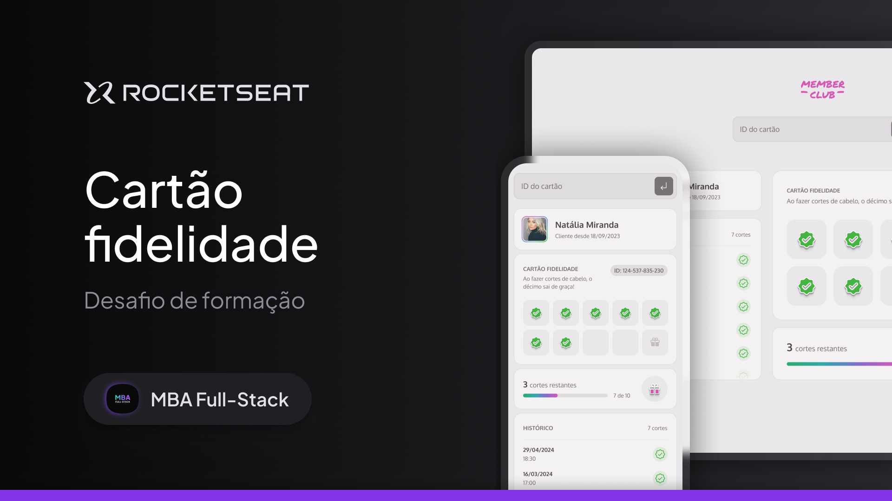

  

Member Club is a web application developed to manage customer loyalty cards

  <a href="alineamano.github.io/member-club">Demo</a>
  ·
  <a href="#-tecnologies">Technologies</a>
  ·
  <a href="#-features">Project</a>
  ·
  <a href="#-license">License</a>

 

  

## Project

Member Club is a responsive web application developed in HTML, CSS, and JavaScript to manage customer loyalty cards, as a practical challenge from Rocketseat's MBA program in partnership with Sirius Education.

## Technologies

This project was developed with the following technologies:

- HTML
- CSS
- Javascript

## Features

The Member Club application offers the following features:

- Allows searching for customer information by ID;
- Validates whether the ID is valid and exists, displaying an error alert if not;
- Displays the customer's image, name, and haircut history including quantity, date, and time;
- Marks each haircut on the loyalty card for the customer;
- Shows progress with the number of remaining haircuts for the reward;
- Presents a congratulations modal with the message: “Congratulations! Your next haircut is free!” upon reaching 10 haircuts.

## License

Distributed under the MIT License. See LICENSE.txt for more information.
